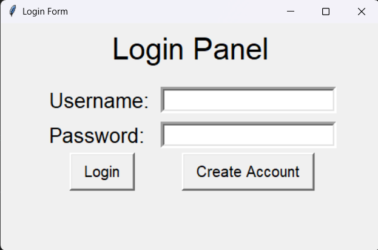
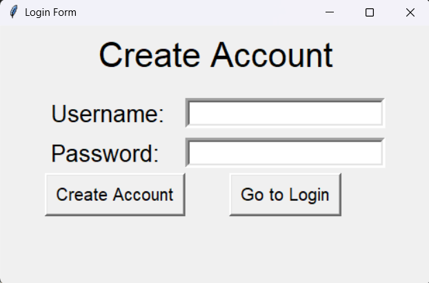
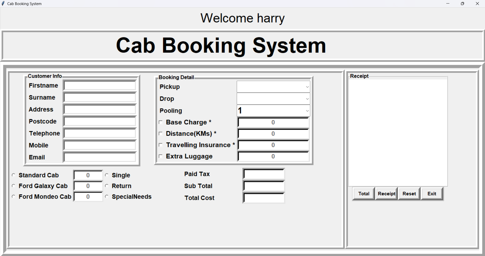

# 🚖 Cab Booking System in Python

A simple yet functional **Cab Booking System** built using Python and the Tkinter library. This project provides a user-friendly interface for booking cabs, calculating fare details, and generating receipts — a great starting point for first-year IT students learning GUI-based Python applications.

---

## 🧩 Overview

This project simulates a real-world cab booking experience, allowing users to register, log in, and book cabs with ease. The system manages customer information, booking details, cost calculations, and receipts, offering an engaging way to learn GUI programming with Tkinter.

---

## ⚙️ Features

- User registration and login system  
- Set and manage customer information  
- Enter booking details (pickup, destination, pooling options, etc.)  
- Select from available cab types  
- Automatic fare calculation (including tax and subtotal)  
- Generate detailed booking receipts with reference numbers and dates  
- Simple, clean, and interactive GUI built with Tkinter  

---

## 🖼️ Screenshots

